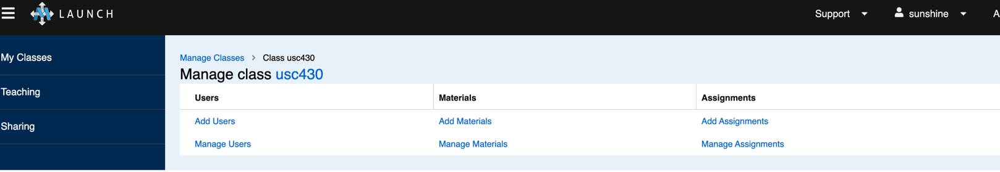

{}
This guide is only for **class** users. Research users should refer to instructions <a href="../getting-started">here</a>.

{}

This guide covers the basic things you need to do to get started using SPHERE in your classes, as a student or a instructor.

{}

This guide assumes you are using the reference portal at `sphere-testbed.net`. Instructions on this page only apply to that portal.

**This content was updated in August 2024. Please read it carefully.**

{}

# Account Setup


Instructors should open their account <a href="https://launch.sphere-testbed.net">here</a> and create an organization for their class (Organizations are on the left menu as the user is logged on). **Please select a short name, like cs322 or usc201 and specify category Class**. Then please [post a support ticket](mailto:contact-project+mergetb-support-email@incoming.gitlab.com) for SPHERE ops to approve the organization. **You need to do this only once per class. Next semester you can reuse the same organization. If another instructor teaches the same class they can also reuse the same organization.**

Students will have their account automatically set up by their instructor.

# Using SPHERE as an Instructor or TA

Instructors will use <a href="https://edu.sphere-testbed.net">our Class UI</a> to create student accounts, retrieve and reset passwords, upload and assign class materials and collect submissions for grading. TAs can do all these activities as well, except that they cannot create new classes. Our Class UI is accessible from our main login page. Once logged in, look for "Class UI" on the top menu.

## Student/TA Account Creation

Click on Teaching (left menu) then on your class. Use option "Add Users" and select student or TA. The system will create the requested accounts and you will be able to see the usernames and passwords under "Manage Users" menu item. One sample class's view is shown below.



**Currently, instructors must hand out username and password combination to each student. The easiest approach would be to print out the Manage students view, cut the paper strips and hand one to each student. We're working on emailing the students' their passwords, and hope to release this feature by September 15, 2024.**

## Student/TA Account Management

Click on Teaching (left menu) then on your class. Use option "Manage Users".  You will be able to edit user information, including their password, and to recycle a user (e.g., in case of a student dropping the class). Students are assigned a generic name at account creation. They can also edit their name from their SPHERE Profile. Please ask the students NOT to edit their password. They should keep their SPHERE-assigned password, as this helps the instructor, TA and SPHERE team debug any issues by logging in as a student.

## Adding/Managing Class Materials

Click on Teaching (left menu) then on your class. Use option "Add Materials" or "Manage Materials". You can add materials to your class, such as a Web page for the course or a homework assignment. **Currently only add-by-URL is supported.** This simply adds a URL to a Web page hosting your class material.

If you have previously used shared materials, they now reside <a href="https://jelenamirkovic.github.io/sphere-education.github.io/">here</a>. If you have previously used private materials, please contact SPHERE ops to receive a ZIP file with your materials from the old platform. You can upload these to a sharing site, such as Google Sites, Drop box, Share point, etc. and use our add-by-URL option to add them to your class.

## Creating Assignments

Click on Teaching (left menu) then on your class. Use option "Add Assignment". You will be able to select your assignment from the existing materials, so please make sure to add materials first and then use them to create assignments. You can now set the release date as well as the due date for each assignment. You can hide assignments under development by making them visible only to Instructors/TAs. At the release date, they will become visible to everyone in your class.

## Downloading Assignments

This option is still under development, with expected release date of September 6, 2024.

# Using SPHERE as a Student

Students will receive their login credentials from their instructor. Should a student forget their password, their instructor can retrieve it or reset it. 

Students will use <a href="https://edu.sphere-testbed.net">our Class UI</a> to interact with class content. Our Class UI is accessible from our main login page. Once logged in, look for "Class UI" on the top menu.

## Accessing Class Materials

To access class materials log into our Class UI. You should be able to view class materials and assignments, and to submit your answers.  To submit an answer to the assignment you would upload **one** file and click "Submit".

## Working on Assignments

Each assignment will have a name of the lab you will work on, let's call it **labname**. To start an experiment and set up the lab follow the steps below.
1. Log into the testbed using your username and password, at <a href="https://launch.sphere-testbed.net">our main site</a>
2. Click on XDCs (left menu) and create a new XDC. Select "personal" type of XDC and name it "xdc". **You should only do this once per class.** Wait a little while and refresh the page. A Jupyter link will become visible.
3. Click on Jupyter link (center window)
4. Click on Terminal if needed - Terminal app may already be active

5. Only the first time you access the testbed via Terminal app, type the text below.
    ```bash
    $ su - yourusername
    $ cd
    $ echo "PATH=$PATH:/share" > .profile
    $ echo yourpassword > pass.txt
    $ exit
    $ su - yourusername
    ```
6. Every other time you access the testbed via Terminal app look at the command line prompt. If the prompt looks like `#`, type
    ```bash
    $ su - yourusername
    ```

Otherwise proceed to the next step.

7. If you are just starting an assignment, to start an experiment, type (use the labname specified in your assignment):
    ```bash
    $ startexp labname
    ```
    Wait until the screen indicates that this has completed. Then type (use the labname specified in your assignment):
    ```bash
    $ runlab labname
    ```
    The `runlab` command may appear to hang in the end. Type ENTER and it should indicate that it has completed.

    If you receive some errors, 
    1. wait a few minutes and try *runlab* command again. 
    2. If that fails again, re-run the sequence of *startexp* and *runlab* one more time. 
    3. If it fails again, please contact your instructor or TA to ask for help.

8. To access your nodes from the terminal window type:
    ```bash
    $ ssh nodename
    ```
    For example, if your topology has nodes `a` and `b` type `ssh a` or `ssh b`. If you need to access multiple nodes at the same time, open another *browser window* and repeat steps 1, 2, 3, 4, 6 and then step 8.

## Finishing Assignments

When you finish an assignment, release the resources by repeating steps 1,2,3,4 above and then typing:
```bash
  $ stopexp labname
```
Answer the questions specified in your lab materials and submit answers using our Class UI.

### Copying Files

Your assignment may ask you to include some files from your experimental nodes. Please follow instructions <a href="../xdc/">here</a> (scroll all the way to the bottom). The instructions assume you have installed `mrg` utility on your home machine. To do so, please obtain the source (and follow README to compile it) or binary <a href="https://gitlab.com/mergetb/portal/cli/-/releases">from this site</a>. After installation <a href="../getting-started/#configuring-the-api-endpoint">configured your API point</a> (you only have to do this once) and have logged into your merge account by doing `mrg login yourusername -p yourpassword` (you have to do this each time you open a new terminal on your machine).

A complete example is in <a href="https://www.isi.deterlab.net/file.php?file=/share/education/twonode/html/index.html#tasks">this assignment</a>.

### Port Forwarding

Your assignment may ask you to perform port forwarding. Follow instructions <a href="../port-forwarding/">here</a> to set up port forwarding. 


{}
You are welcome to read the rest of the documentation, but this current page summarizes everything you will need for class use.
{}
