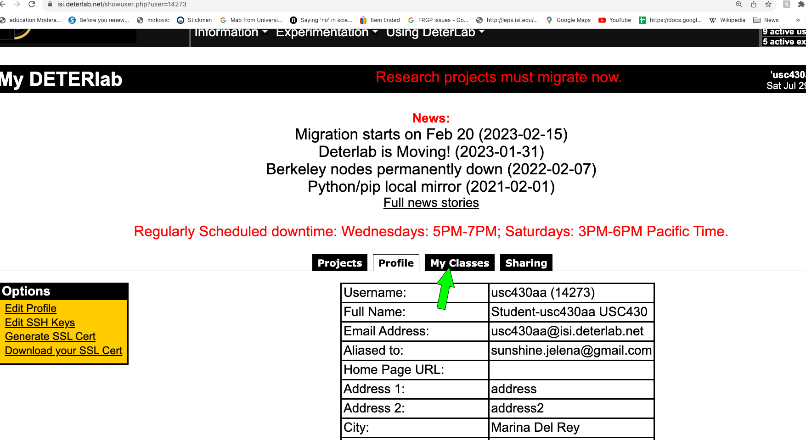
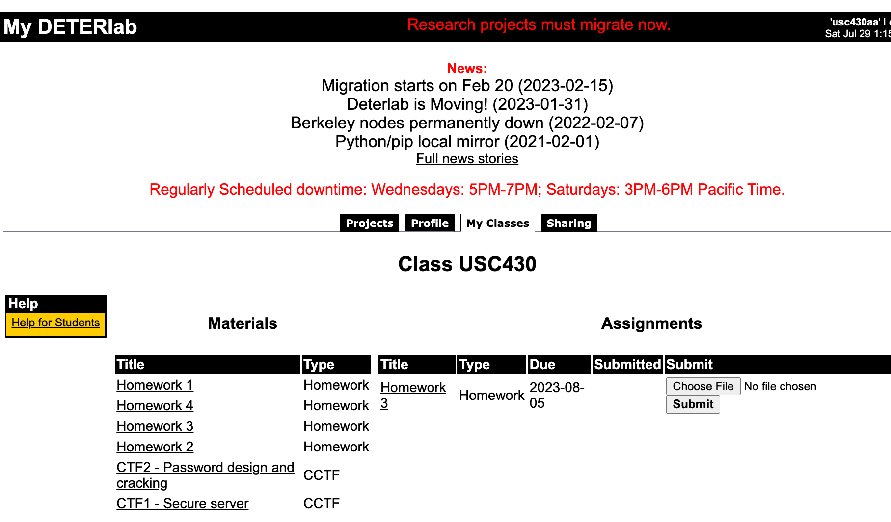

{}
This guide is only for **class** users. Research users should refer to instructions <a href="../getting-started">here</a>.

{}

This guide covers the basic things you need to do to get started using SPHERE in your classes, as a student or a instructor.

{}

This guide assumes you are using the reference portal at `sphere-testbed.net`. Instructions on this page only apply to that portal.

{}

# Account Setup

Instructors and students will have their account automatically set up by our legacy software. Instructors please refer to guidelines <a href="https://docs.deterlab.net/support/class/">in our legacy documentation</a>, which have been updated. Students, your accounts will be created by your instructor.

# Using SPHERE as an Instructor

Instructors will use <a href="https://isi.deterlab.net">our legacy Web page</a> to create student accounts, retrieve and reset passwords, upload and assign class materials and collect submissions for grading. This workflow remains the same as before. A instructor only needs to <a href="https://docs.deterlab.net/support/migration/#migrateclass">migrate their class</a> once and then **continue using legacy SPHERE to manage their class as usual**.

## Migrating Class Materials

If you have used some shared or private class materials on DeterLab, please refer to <a href="https://docs.deterlab.net/education/migrating-materials">our guidelines on migrating your materials to our new platform</a>.

# Using SPHERE as a Student

Students will receive an email with their username and password as instructors create their SPHERE accounts. The same username and password can be used at our <a href="https://isi.deterlab.net">legacy site</a> to access class materials and upload submissions, and at our <a href="https://sphere-testbed.net">current site</a> to work on class assignments. Should a student forget their password, their instructor can retrieve it or reset it. Please refer to documentation <a href="https://docs.deterlab.net/education/course-setup/#managing-a-class">at our legacy site</a>.

## Accessing Class Materials

To access class materials log into our <a href="https://isi.deterlab.net">legacy site</a> and click on "My Classes" tab.



You will then be able to see materials that your instructor shared with the class, and your assignments. To submit an assignment you would upload **one** file and click "Submit".



## Working on Assignments

Each assignment will have a name of the lab you will work on, let's call it **labname**. To start an experiment and set up the lab follow the steps below.
1. Log into the testbed using your username and password, at <a href="https://launch.sphere-testbed.net">current site</a>
2. Click on XDCs (left menu)
3. Click on Jupyter link (center window)
4. Click on Terminal if needed - Terminal app may already be active

5. Only the first time you access the testbed via Terminal app, type the text below.
    ```bash
    $ su - yourusername
    $ echo "PATH=$PATH:/share" > .profile
    $ echo yourpassword > pass.txt
    $ exit
    $ su - yourusername
    ```
6. Every other time you access the testbed via Terminal app look at the command line prompt. If the prompt looks like `#`, type
    ```bash
    $ su - yourusername
    ```

Otherwise proceed to the next step.

7. If you are just starting an assignment, to start an experiment, type
    ```bash
    $ startexp labname
    ```
    Wait until the screen indicates that this has completed. Then type:
    ```bash
    $ runlab labname
    ```
    The `runlab` command may appear to hang in the end. Type ENTER and it should indicate that it has completed.

    If you receive some errors, 
    1. wait a few minutes and try *runlab* command again. 
    2. If that fails again, re-run the sequence of *startexp* and *runlab* one more time. 
    3. If it fails again, please contact your instructor or TA to ask for help.

8. To access your nodes from the terminal window type:
    ```bash
    $ ssh nodename
    ```
    For example, if your topology has nodes `a` and `b` type `ssh a` or `ssh b`. If you need to access multiple nodes at the same time, open another *browser window* and repeat steps 1, 2, 3, 4, 6 and then step 8.

## Finishing Assignments

When you finish an assignment, release the resources by repeating steps 1,2,3,4 above and then typing:
```bash
  $ stopexp labname
```
Answer the questions specified in your lab materials and submit answers using our <a href="https://isi.deterlab.net">legacy site</a>.

### Copying Files

Your assignment may ask you to include some files from your experimental nodes. Please follow instructions <a href="../xdc/">here</a> (scroll all the way to the bottom). The instructions assume you have installed `mrg` utility on your home machine. To do so, please obtain the source (and follow README to compile it) or binary <a href="https://gitlab.com/mergetb/portal/cli/-/releases">from this site</a>. After installation <a href="../getting-started/#configuring-the-api-endpoint">configured your API point</a> (you only have to do this once) and have logged into your merge account by doing `mrg login yourusername -p yourpassword` (you have to do this each time you open a new terminal on your machine).

A complete example is in <a href="https://www.isi.deterlab.net/file.php?file=/share/education/twonode/html/index.html#tasks">this assignment</a>.

### Port Forwarding

Your assignment may ask you to perform port forwarding. Follow instructions <a href="../port-forwarding/">here</a> to set up port forwarding. 


{}
You are welcome to read the rest of the documentation, but this current page summarizes everything you will need for class use.
{}
